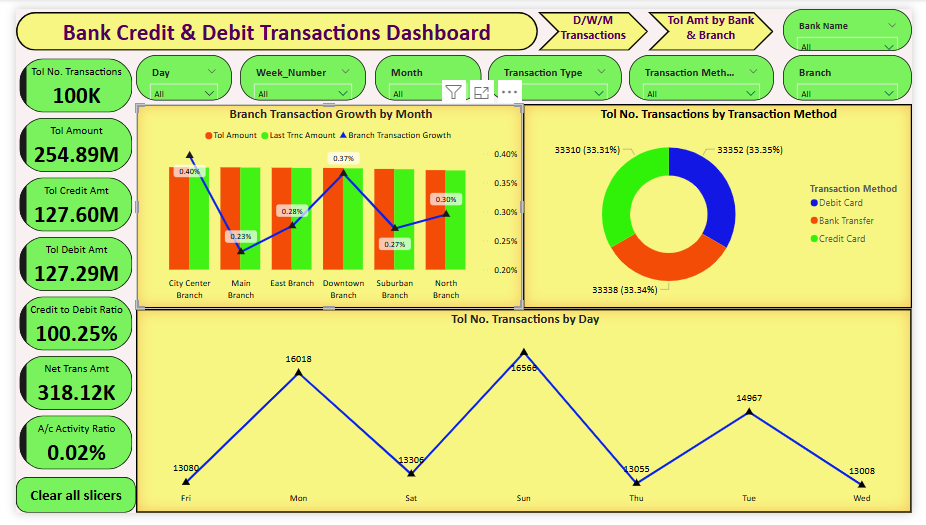
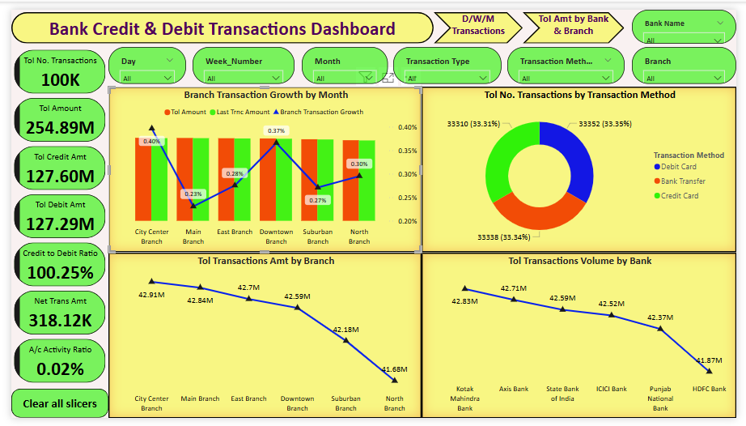

# bank-transactions-dashboard-powerbi-sql

## 🏦 Bank Credit & Debit Transactions Dashboard – SQL + Power BI

An interactive analytics dashboard designed using SQL and Power BI to explore and visualize banking transactions. 
This project focuses on credit and debit trends, customer behavior, and financial KPIs across multiple dimensions such as time, branch, and bank.

## 📌 Project Overview

This dashboard provides actionable insights into:
Transaction types (Credit vs Debit)
Transaction methods (Card, Bank Transfer, etc.)
Customer behavior across days, weeks, and months
Branch performance and bank-level volumes
Key financial ratios and activity metrics

🔧 Built with real-world logic to simulate a banking environment, this project is ideal for showcasing SQL + Power BI integration in financial analytics.

## 🛠️ Tools & Technologies Used

📌 SQL – Data transformation, filtering, grouping, and KPI logic

📌 Power BI – Interactive dashboard creation, DAX measures, time-based slicing

📌 DAX – Custom calculated fields for Net Amount, Ratios, Growth Metrics

📌 Excel/CSV – Source data storage and schema mapping

##  📊 Dashboard Features

Visual	Description

🔢 KPIs Panel:	Total Transactions, Credit & Debit Amounts, Credit-to-Debit Ratio, Net Transaction Amount, Account Activity Ratio

📈 Branch-wise Growth:	Current vs Last Month transaction values & growth %

📊 Transaction Method Split:	Donut chart displaying Debit Card, Bank Transfer, and Credit Card usage

📅 Day-wise Trend:	Volume of transactions per day of the week

🏢 Branch Comparison:	Total transaction amount by each branch

🏦 Bank Comparison:	Total transaction volume by bank

📆 Monthly & Weekly Trends:	Line graphs showing transaction trends across time periods

##  📸 Dashboard Snapshots

🔹 Full Dashboard View

🔹 Expanded View with Branch & Bank Comparisons

🔹 Monthly Transactions

🔹 Weekly Transactions

##  🔍 Key Insights

💡 Transaction volume is consistent across methods (~33% each).

💡 Credit slightly exceeds debit transactions (Credit-to-Debit Ratio: 100.25%).

💡 Most active transaction days: Monday and Sunday.

💡 Branches like City Center and Downtown show highest growth.

💡 December saw a steep drop in transactions (possibly seasonal or system-related).

💡 Specific banks (e.g., Kotak, Axis) lead in total volume.

##  📤 How to Run This Project

📌 Load the dataset into your SQL environment and execute transformation queries.

📌 Use the SQL output or views to connect with Power BI.

📌 Open the .pbix file and ensure the data connection is active.

📌 Refresh visuals and interact using slicers for Day, Week, Month, Branch, Method, etc.

##  💼 Portfolio Value

#### This project demonstrates:

🗂️ Real-world data storytelling

🗂️ SQL-to-Power BI integration

🗂️ Time series and comparative analysis

🗂️ Financial KPI calculations

🗂️ Clean, vibrant dashboard design

## 🔗 Project Link

https://github.com/jakeer-da/bank-transactions-dashboard-powerbi-sql

## 🙋‍♂️ About Me

**Syed Jakeeer Hussin** 

🎯 **Junior Data Analyst** with hands-on experience in building interactive dashboards, uncovering trends, and delivering data-driven insights.

📊 Skilled in SQL, Power BI Python(Basics), and Excel for end-to-end analytics solutions.

## 💼 Core Competencies

| Skill Area             | Tools & Technologies                                       |
|------------------------|------------------------------------------------------------|
| **Data Visualization** | Power BI, Excel Charts & Graphs                   |
| **Data Analytics**     | SQL, Excel (Pivot Tables, VLOOKUP, Data Cleaning)          |
| **Programming**        | Python (Pandas, Matplotlib, Seaborn)                |
| **Database**           | MySQL                                       |
| **DAX & Measures**     | KPIs, Ratios, Time Intelligence, Growth Metrics            |
| **Dashboard Design**   | Interactive layouts, slicers, filters, drill-through views |
| **Tools & Platforms**  | Jupyter Notebook, Google Colab, GitHub, Excel, Power BI Service    

## 👨‍💻 Author
**Syed Jakeeer Hussin**  
